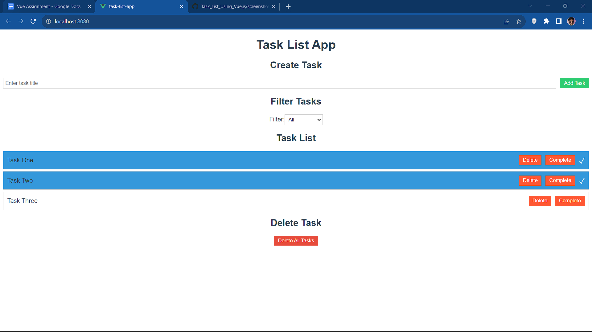
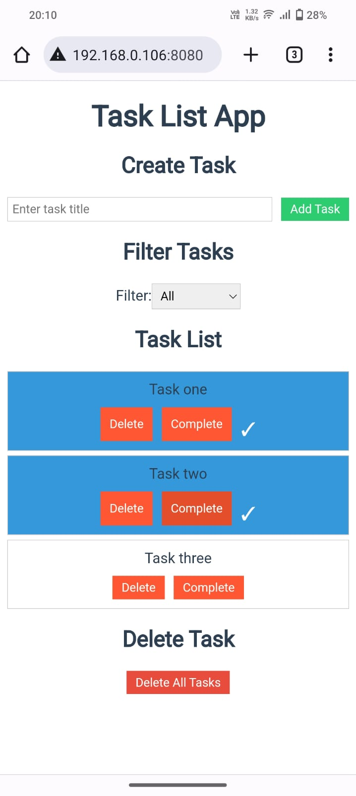

# Task List Application

A simple task list application built with Vue.js that allows users to manage tasks. This project demonstrates the use of Vue.js for user interface interactions and state management.

## Give it a Try: http://35.200.155.237/

## Technologies Used

- Vue.js
- HTML/CSS
- JavaScript

## Features

- Display a list of tasks.
- Add new tasks to the list.
- Remove tasks from the list.
- Filter tasks based on completion status (all, completed, incomplete).
- Mark tasks as completed and display them differently.
- Responsive design for both desktop and mobile devices.
- Animations for better user experience.

## Running the Application Locally

To run the application on your local machine, follow these steps:

1. Clone the repository to your local machine:

```bash
git clone https://github.com/your-username/task-list-app.git
```

2. Navigate to the project directory:

```bash
cd task-list-app
```

3. Install dependencies:

```bash
npm install
```

4. Start the development server:

```bash
npm run serve
```

5. Open your web browser and go to `http://localhost:8080` to view the application.

## Correctness of the Application

The application meets the following functional requirements:

- Display tasks in a list.
- Add new tasks.
- Remove tasks.
- Filter tasks by completion status.
- Mark tasks as completed and style them differently.

## Code Quality and Organization

The code is well-structured and organized into components. Vue.js is used for state management and user interface interactions.

## Screenshots

### Web View



### Phone View



## License

This project is licensed under the MIT License - see the [LICENSE](LICENSE) file for details.
